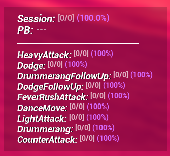
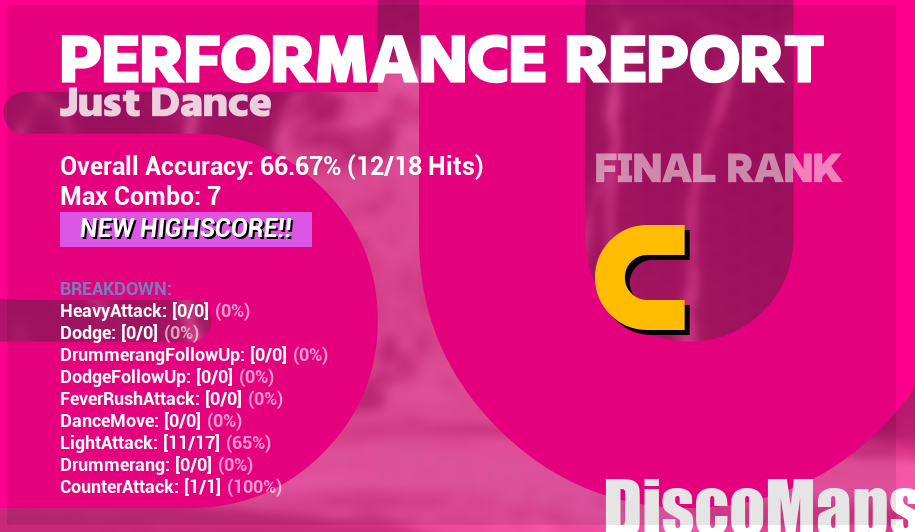

# Performance Tracker Mod for Dead as Disco (UE4SS)

A high-performance Lua mod for **Dead as Disco (Demo)** built on the UE4SS framework. This mod provides real-time combat analytics, dynamic visual feedback, and a persistent history system to track your personal best scores directly within the game.

## Features

- **Live Combat Analytics:** Tracks "Perfect" hits vs total actions across all abilities (Attack, Dodge, etc.).
- **Dynamic Accuracy Feedback:** The HUD changes colors dynamically based on your current performance (from Electric Purple for SS Rank down to Red for D/F Ranks).
- **Persistent Personal Bests (PB):** Automatically saves your highest score and best accuracy per song, caching it for zero-latency comparisons during gameplay.
- **Achievement Medals:** Displays a stylized `NEW HIGHSCORE!!` badge on the results screen when you beat your previous record.
- **Lightweight & Performant:** Designed with a Domain-Driven Architecture and aggressive RAM caching to ensure 0 frame drops during intense gameplay.

## Installation

1. Ensure you have the latest version of [UE4SS](https://github.com/UE4SS-RE/RE-UE4SS/releases) installed in your `Dead as Disco Demo/Pagoda/Binaries/Win64/` directory.
2. Download the `PerformanceTracker` mod folder.
3. Extract the `PerformanceTracker` folder into `Dead as Disco Demo/Pagoda/Binaries/Win64/ue4ss/Mods/`.
4. Open the `mods.txt` file located in the `Mods/` directory and ensure `PerformanceTracker : 1` is present.

## Screenshots

  
  
  
<i>Left: In-game HUD showing real-time accuracy. Right: Post-game results with the HighScore badge.</i>

## Keybinds

| Key | Action |
|---|---|
| **F3** | Toggle HUD Visibility (On/Off) |
| **F4** | Force HUD On |
| **F5** | Force HUD Off |

## Configuration (`config.lua`)

You can customize the visual behavior of the mod by editing the `config.lua` file located in `Mods/PerformanceTracker/Scripts/config.lua`.

| Variable | Default Value | Description |
|---|---|---|
| `cfg.LOG_LEVEL` | `"info"` | Determines the verbosity of the `UE4SS.log`. Set to `"debug"` or `"trace"` if you are a developer looking for detailed logs. |
| `cfg.HUD_UPDATE_INTERVAL_MS` | `400` | The refresh rate (in milliseconds) for the live in-game HUD. Lower values update faster but may use slightly more CPU. |
| `cfg.HUD_MAIN_ALLIGNMENT` | `"bottomright"` | The screen anchor position for the in-game HUD. (Options: `"center"`, `"top"`, `"bottom"`, `"topleft"`, `"topright"`, `"bottomleft"`, `"bottomright"`). |
| `cfg.HUD_LABEL_LAYOUT` | `"friendly"` | The naming convention for tracked abilities. Options: `"full"` (e.g., `GA_Player_Taunt_C`), `"friendly"` (e.g., `DanceMove`), or `"shortname"` (e.g., `DNC`). |

> **Note:** The internal mod name and core timing variables should not be altered as they are critical for the mod's architecture and save system.

## Troubleshooting

- **HUD isn't showing:** Press **F4** to force visibility. Ensure `PerformanceTracker : 1` is in your `mods.txt`.
- **Logs are missing/empty:** Check that `cfg.LOG_LEVEL` is set to `"info"` or `"debug"`.
- **PB isn't saving:** The mod saves data to `Mods/PerformanceTracker/Data/performance_history.json`. Ensure the game has write permissions to this directory.

## Architecture Highlights

This mod was built leveraging standard UE4SS methodologies combined with an MVC/State-Driven architectural pattern to completely isolate UI logic from data polling, guaranteeing maximum performance even during heavy visual sweeps triggered by the game's Engine.
